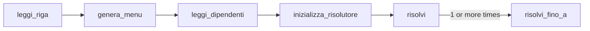

# Il Catering Impossibile

Final project for the **Algorithms and Data Structures** course — Politecnico di Milano, A.Y. 2025–2026.
Grade: **30/30**.

A **SAT** solver (Boolean satisfiability: is there a true/false assignment to the variables that makes every clause true?) written in pure C, with no external libraries.

> Identifiers in the source code are in Italian. Key terms: *piatto* = dish, *dipendente* = employee, *richiesta* = request (literal), *menu* = menu, *assegnamento* = assignment, *scommessa* = guess/decision, *traccia* = trail.

---

## 1. The problem

- A **menu** of dishes: each dish is a Boolean variable (served / not served).
- A list of **employees**: each one is happy if *at least one* of their requests is met.
  - `pasta` → "I want pasta to be served"
  - `-pasta` → "I want pasta **not** to be served"

In SAT terms: each employee is a **clause** (an OR of literals), each request is a **literal** (a variable or its negation), and the whole file is a formula in **CNF** (Conjunctive Normal Form: an AND of clauses).

**Goal**

1. If a menu exists that makes everyone happy → print `OK`.
2. Otherwise → print `KO`, then remove employees **from the end** until a valid menu exists again, printing a line `-i` for each removal, and finally `OK`.

---

## 2. I/O format

**Input** (from `stdin`)

```
<dish_1> <dish_2> ... <dish_n>      ← line 1: the menu
<requests of employee 1>            ← following lines: one employee per line
<requests of employee 2>
...
```

**Output** (to `stdout`)

| Case | Output |
|---|---|
| All satisfiable | `OK` |
| *k* removals needed | `KO`, then `-1`, `-2`, …, `-k`, then `OK` |

### Example 3

```
a b c d
a -a c        ← C0: contains a and ¬a → always satisfied (tautology)
c             ← C1: c must be served
-c            ← C2: c must not be served → contradicts C1
b -b          ← C3: tautology
```

Output: `KO`, `-1`, `-2`, `OK` → the longest satisfiable prefix is {C0, C1}: the last 2 must be removed.

### Example 4

```
a b c d
a
-a b
-a -b c
-a -b -c d
-a -b -c -d   ← forces ¬d, but the lines above force d
```

Output: `KO`, `-1`, `OK`.

---

## 3. Build and run

Same command as the official evaluator:

```bash
gcc -DEVAL -std=gnu11 -Wall -Werror -O2 -pipe -static -s -o catering main.c -lm
./catering < example3.txt
```

---

## 4. Architecture



| Phase | Functions | What it does |
|---|---|---|
| Input | `leggi_riga`, `conta_token` | Reads a line of arbitrary length |
| Menu | `genera_menu`, `fetch_id_piatto`, `fetch_richiesta` | Dish name → numeric id |
| Clauses | `leggi_dipendenti`, `aggiungi_richiesta` | Builds and cleans the clauses |
| Index | `costruisci_occorrenze` | For each literal: which clauses it appears in |
| SAT engine | `assegna`, `disfa_fino_a`, `aggiorna_contatori`, `propaga`, `scommetti` | Iterative DPLL |
| Prefix search | `risolvi` | Exponential + binary search |

---

## 5. Input and preprocessing

### 5.1 `leggi_riga` — lines of any length

A dynamic buffer starts at 256 bytes and **doubles** (`realloc`) until `fgets` reaches `\n`. Trailing `\n` and `\r` are stripped (Windows file compatibility). Doubling gives an **amortized** O(1) cost per character (the total cost of all copies is at most twice the final length).

### 5.2 `genera_menu` — from name to id

1. Each dish gets an id `1..n` in file order (`0` is reserved: "not found" / "tautology").
2. The `menu` array is sorted by name with `qsort`.
3. Every later lookup uses `bsearch` → **O(log n)** per token instead of O(n).

`fetch_richiesta` turns a token into a **signed literal**: `pasta` → `+id`, `-pasta` → `−id`, unknown dish → `0` (discarded).

### 5.3 `leggi_dipendenti` — cleaning the clauses

Clauses are stored in **CSR** format (Compressed Sparse Row: all literals in a single flat array `richieste`, plus an offset array `inizio_richieste` marking where each clause starts).

```
richieste:        [ 0 | 3 | -3 | 0 ]
inizio_richieste: [ 0,  1,  2,   3,  4 ]
                    C0  C1  C2   C3  end
```

Advantages: a single allocation, contiguous memory (cache-friendly), no per-clause pointers.

While reading, two simplifications are applied in O(1) per token:

| Case | Example | Action |
|---|---|---|
| **Duplicate** | `a b a` | the second `a` is ignored |
| **Tautology** | `a -a c` | the clause becomes the single sentinel `[0]` = "always satisfied" |

The trick: `visto_positivo[id]` and `visto_negativo[id]` store the **line number** where the literal was last seen. Comparing with the current line is enough: **no clearing** of the arrays between lines.

Note: an empty line (or one with only unknown dishes) becomes an **empty clause** → impossible to satisfy.

### 5.4 `costruisci_occorrenze` — inverted index

It answers quickly: *"I assign literal ℓ: which clauses does it affect?"*

Literals are mapped to contiguous indices by the `RICHIESTA_INDICIZZATA` macro:

| Literal | Index |
|---|---|
| `+id` (1..n) | `id` |
| `−id` | `n + id` |

The index is built with a **counting sort** in two passes:

1. count how many times each literal appears;
2. **prefix sums** (each cell = sum of the previous ones) → `inizio_occorrenze[ℓ]` = where ℓ's list starts;
3. fill `occorrenze` with the employee indices.

Again CSR format, cost O(total literals).

---

## 6. The SAT engine: iterative DPLL

**DPLL** (Davis–Putnam–Logemann–Loveland) = backtracking + unit propagation. Implemented **without recursion**, using an explicit stack.

### 6.1 State

| Variable | Meaning |
|---|---|
| `assegnamenti[id]` | `+1` served, `−1` not served, `0` undecided |
| `conta_vere[c]` | number of **true** literals in clause *c* |
| `conta_indecise[c]` | number of **unassigned** literals in *c* |
| `traccia_piatti`, `traccia_richieste` | **trail**: ordered list of the assignments made (so they can be undone) |
| `scommesse[]`, `traccia_pre_scommessa[]`, `richiesta_girata[]` | decision stack: chosen literal, trail length before the choice, whether it has already been flipped |
| `coda_unitarie`, `in_coda` | FIFO queue of clauses to check (+ anti-duplicate flag) |

A clause *c* is:

- **satisfied** if `conta_vere > 0`;

otherwise (`conta_vere == 0`) it is:

- **unit** if `conta_indecise == 1` → its only free literal is **forced**;
- **conflicting** if `conta_indecise == 0` → no way out.

### 6.2 `aggiorna_contatori` — counter-based propagation

When literal ℓ is assigned (`verso = +1`):

- clauses containing **ℓ** → `vere++`, `indecise--` (now satisfied);
- clauses containing **¬ℓ** → `indecise--`; if they become unit or empty, they are queued.

Undoing (`verso = −1`) performs exactly the inverse operation, which makes backtracking cheap. Cost of one assignment: O(occurrences of ℓ and ¬ℓ).

> Design choice: counters instead of *watched literals* (2 watched literals per clause, used by industrial solvers). Simpler to write and to undo; slower only on very large instances.

`limite_dipendenti` makes the engine ignore clauses beyond the prefix under test: the same index serves **every** prefix, with no rebuilding.

### 6.3 `propaga`

Drains the queue:

- clause already satisfied → skip;
- `indecise == 0` → **conflict**, return 0;
- `indecise == 1` → `fetch_richiesta_obbligata` finds the free literal and assigns it (which may queue further clauses: a **chain reaction**).

### 6.4 `scommetti` — branching heuristic

When propagation stops without conflicts, the solver has to **guess**:

1. **Which clause**: the unsatisfied one with the **fewest free literals** (shorter clauses are closest to a conflict: tackling them first exposes dead ends early). It exits immediately on a clause with 2, the minimum possible after propagation.
2. **Which literal**: the one appearing **most often** in the formula (static index `inizio_occorrenze`) → satisfies the most clauses in one move.

If no clause is unsatisfied → return 0 = **satisfiable** (any variables still free can take any value).

### 6.5 `risolvi_fino_a(k)` — the main loop

Checks whether the first *k* employees are satisfiable.

```
initialize counters; tautologies → already satisfied
queue unit/empty clauses
loop:
    if propaga() succeeds:
        ℓ = scommetti()
        if ℓ == 0 → return SAT
        push decision ℓ (not flipped); assegna(ℓ)
    else (conflict):
        pop all decisions already flipped (both branches failed)
        if the stack is empty → return UNSAT
        undo back to the top decision, flip it (ℓ → ¬ℓ), mark it flipped
        assegna(¬ℓ)
```

This is **chronological backtracking**: the solver always returns to the most recent decision with an unexplored branch. Each decision has two branches (ℓ and ¬ℓ); the `richiesta_girata` flag records whether the second one is already in progress.

---

## 7. Longest-prefix search (`risolvi`)

**Monotonicity**: if the first *k* employees are unsatisfiable, so are the first *k+1* (adding clauses only adds constraints). So there is a single breaking point → it can be found by binary search.

Invariant: `basso` = a **satisfiable** prefix, `alto` = an **unsatisfiable** prefix.

1. Try all employees: if OK, done.
2. **Exponential search from the top** (*galloping*): on each unsatisfiable prefix, `alto` moves down to the candidate just tested and `salto` (the step) doubles (1, 2, 4, 8, …). Steps add up, so the candidates are `n−1`, `n−3`, `n−7`, `n−15`, … (i.e. `n − (2^i − 1)`), until a prefix is satisfiable (or 0 is reached, trivially satisfiable).
3. **Binary search** in the interval `(basso, alto)` found.

Why start from the top: if *k* removals are needed, **O(log k)** solver calls are enough instead of O(log n). In typical cases *k* is small.

Finally it prints `KO`, then `-1 … -(n − basso)`, then `OK`.

### Trace on Example 3 (n = 4)

| Call | Prefix | Result | State |
|---|---|---|---|
| `risolvi_fino_a(4)` | C0..C3 | UNSAT (C1 forces c, C2 conflicts) | alto = 4 |
| `risolvi_fino_a(3)` | C0..C2 | UNSAT | alto = 3 |
| `risolvi_fino_a(1)` | C0 | SAT | basso = 1 |
| `risolvi_fino_a(2)` | C0..C1 | SAT | basso = 2 |

Removals: 4 − 2 = 2 → `KO`, `-1`, `-2`, `OK`.

---

## 8. Complexity

| Phase | Cost |
|---|---|
| Reading the menu | O(n log n) |
| Reading the clauses | O(L log n), L = total number of literals |
| Occurrence index | O(n + L) |
| One DPLL call | exponential in the worst case (SAT is NP-complete); in practice propagation prunes most of the tree |
| Prefix search | O(log k) DPLL calls, k = removals |

Memory: O(n + m + L), where m = number of employees.

---

## 9. Implementation details

- **Everything static and global**: no state passed between functions, no allocation inside the search loop.
- **Allocations**: all one-off; dynamic arrays grow by doubling and are finally shrunk (`realloc`) to their exact size.
- **Exit codes**: every failed `malloc`/`realloc` terminates with a distinct code (2–15) that pinpoints the exact location. Memory is not freed at the end of the program: the operating system does it.
- **`assegnamenti` is `signed char`**: 1 byte per variable, more data fits in cache.

---

## 10. Testing

- Output identical to `example3.output.txt` and `example4.output.txt`.
- Compiles with no warnings under `-Wall -Werror`.
- Cross-checked against a **brute-force** solver (all 2ⁿ assignments) on 400 random instances (up to 6 dishes and 12 employees, including duplicates, tautologies, empty lines and unknown dishes): no differences.
